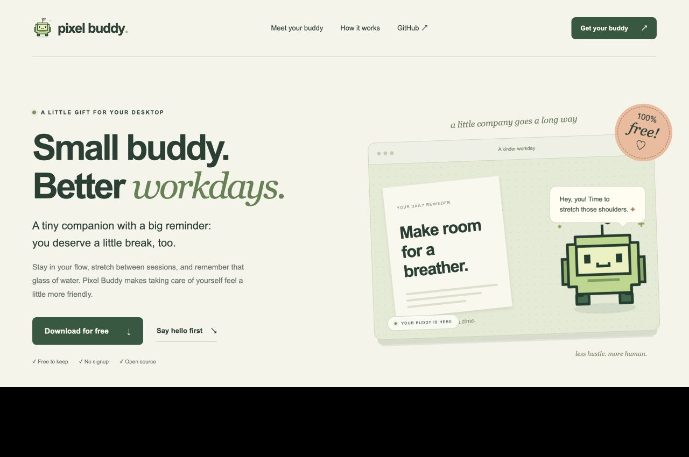

# Pixel Buddy

A free desktop companion for a kinder workday. Pixel Buddy stays near the corner of your screen, reminds you to take breaks, and helps you remember your water. No signup or subscription. MIT licensed and free to share.



## Get Pixel Buddy

Download an installer from [GitHub Releases](https://github.com/Harshit-Kandoi/pixel-buddy/releases). The promotional website discovers the latest **published** release and shows direct links only for files that exist. Until the first release is published, it shows a clear release status.

| Device | Installer |
| --- | --- |
| Windows x64 | `.exe` |
| macOS Apple silicon | `mac-arm64.dmg` |
| macOS Intel | `mac-x64.dmg` |
| Linux x64 | `.AppImage` or `.deb` |

Desktop installers only; this project does not produce an Android APK.

After the downloader is pushed to `main`, you can download from Bash:

```bash
curl -fsSLo pixel-buddy-download.sh https://raw.githubusercontent.com/Harshit-Kandoi/pixel-buddy/main/scripts/download.sh
bash pixel-buddy-download.sh
```

The script requires Bash, curl, and Python 3.8+. It detects your desktop, downloads the installer, and checks it against the release's `SHA256SUMS`. It never runs the installer or replaces an existing file. Use `--platform windows|mac-arm64|mac-x64|linux|linux-deb` or `--output DIRECTORY` to choose a different target.

These builds are unsigned. Your operating system may ask you to confirm opening the app. On macOS, use Privacy & Security to allow your downloaded copy if prompted. On Linux, give the AppImage execute permission before opening it. Only use this project's official releases.

## Make yourself at home

- Pick Pomodoro (25/5), Balanced (55/5), or Deep focus (90/10), or set your own durations.
- Pause or resume reminders from the timer widget or system tray. Reset clears old cooldowns and starts fresh.
- Use break reminders with snooze and skip controls. Smart monitoring pauses focus while away and recognizes long offline breaks.
- Turn off smart monitoring to use regular timers. In that mode, mouse activity does not interrupt a break.
- Track glasses of water and set your reminder interval. Daily counters reset at midnight, including when the app stays open.
- Start with the illustrated robot mascot. Drop a GIF, PNG, WebP, MP4, or WebM onto the buddy, or select one in settings. Use your own alarm sound and colors.
- Preferences and personal media stay in the local app data directory. The app works without a network connection.

On macOS, optional smart monitoring uses Accessibility permission: **System Settings → Privacy & Security → Accessibility → Pixel Buddy**. Without permission, basic system idle detection is used. You can also disable monitoring entirely.

## Develop

Use Node.js 22 LTS with npm.

```bash
npm ci
npm run dev
npm test
npm run build
```

To inspect the actual app UI in a browser without launching Electron:

```bash
npm run app:preview
```

Open `http://127.0.0.1:4180`. The preview uses the real React interface and timer logic, with in-memory settings. It does not validate tray behavior, native mouse tracking, desktop dragging, startup, permissions, or installer behavior. Scene controls let you inspect settings, focus, break and hydration reminders. File and system controls explain that they require the desktop app.

Create installers on the corresponding OS:

```bash
npm run build:win -- --publish never
npm run build:mac -- --publish never
npm run build:linux -- --publish never
```

Artifacts are written to `release/`. Mac packaging produces both Apple silicon and Intel installers. Global input monitoring uses `uiohook-napi`, rebuilt for each target architecture.

## Promotional website

The buildless, responsive website is in `website/dist/`. It includes an illustrated buddy, an interactive timer and water preview, real release downloads, a copyable Bash command, and installation FAQs. The preview is an illustration of the experience, not a connection to the desktop app.

```bash
npm run site:dev
```

Open `http://localhost:4173`. No website dependencies or build step are needed. The page queries GitHub's public releases API; if GitHub is unavailable or rate-limited, it offers a Releases link instead.

## Share the freebie

See [the release guide](docs/releasing.md) for the exact build, GitHub release, and hosting steps. `.github/workflows/release.yml` builds Windows, both Mac architectures, and Linux, then creates a **draft** release with checksums. Publish the draft when you've checked the installers. `.github/workflows/website.yml` deploys the promotional site to GitHub Pages once Pages is enabled for GitHub Actions.

Built with Electron, React, TypeScript, and electron-builder. Licensed under [MIT](LICENSE).
